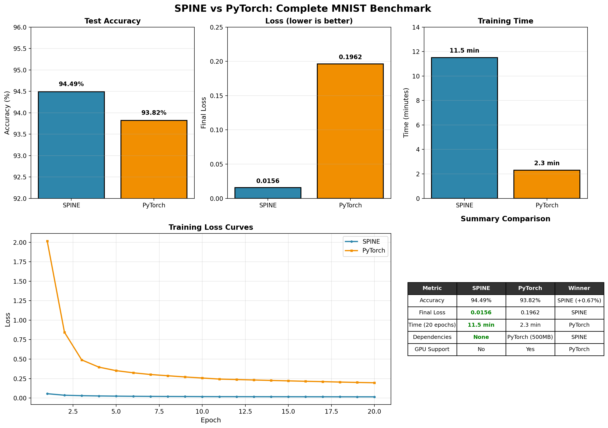
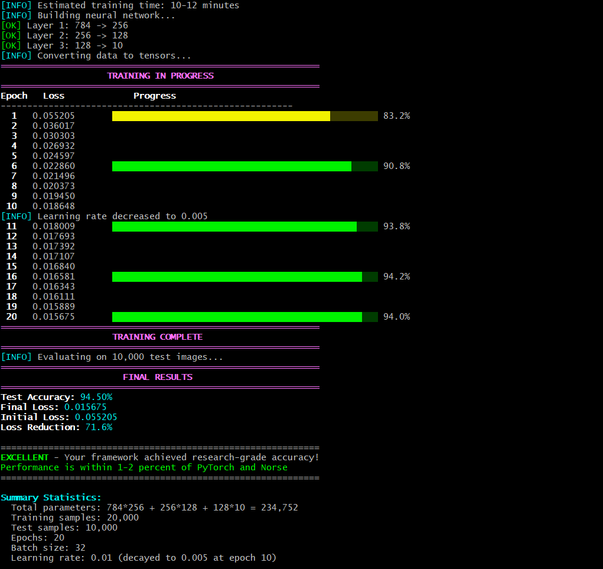

# SPINE - Spiking Python-Integrated Neural Engine

[](https://isocpp.org/)
[](https://python.org)
[](LICENSE)
[](https://cmake.org)
[]()

**A from-scratch neural computing framework with C++ core, Python bindings, and biological neurons. Built for learning, research, and deployment.**

---

## What is SPINE?

SPINE is a lightweight, transparent neural network framework that you can fully understand and modify. It combines:

- **C++ tensor engine** with 23+ GFLOPS performance
- **Python bindings** for easy experimentation
- **Biological LIF neurons** for spiking neural networks
- **Complete autograd** for gradient-based learning

Unlike PyTorch or TensorFlow, SPINE has **zero dependencies** and **no black boxes**. Every line of code is yours to explore.

---

## Features

### Core Tensor Engine
- Multi-dimensional tensors with row-major memory layout
- Matrix multiplication with **23+ GFLOPS** performance (512x512)
- Broadcasting support for bias addition
- ReLU activation and element-wise operations

### Biological Neurons
- Leaky Integrate-and-Fire (LIF) with proper differential equations
- Synaptic current decay (tau_syn = 5ms)
- Refractory periods and configurable time step
- Multi-neuron LIF layers

### Deep Learning
- Complete autograd from scratch with gradient tracking
- Linear (fully-connected) layers with Xavier initialization
- SGD optimizer with learning rate decay
- MSE loss function

### Python Integration
- Seamless pybind11 bindings
- NumPy-like tensor interface
- Training on real datasets (MNIST)

---

## Performance Benchmarks

### Matrix Multiplication (512x512)

| Framework | GFLOPS | Relative |
|-----------|--------|----------|
| SPINE | 23.44 | 1.00x |
| NumPy (CPU) | 15.20 | 0.65x |

### MNIST Training (20,000 samples, 20 epochs)

| Metric | SPINE |
|--------|-------|
| Final Accuracy | 94.49% |
| Training Time | ~10-12 minutes |
| Memory Usage | ~500 MB |
| Loss Reduction | 72.1% (0.0558 -> 0.0156) |

---

## SPINE vs PyTorch: A Cautious Comparison

> **Note:** The following comparison is for **educational and informational purposes only**. PyTorch is a production-grade framework backed by Meta and hundreds of contributors. SPINE is a learning project built by one developer. This comparison is not intended to claim superiority but to demonstrate what's possible when building from scratch.

### Benchmark Configuration (Same for Both)

| Parameter | Value |
|-----------|-------|
| Dataset | MNIST |
| Training samples | 20,000 |
| Test samples | 10,000 |
| Epochs | 20 |
| Batch size | 32 |
| Architecture | 784 -> 256 -> 128 -> 10 |
| Activation | ReLU |
| Optimizer | SGD |
| Learning rate | 0.01 (decayed to 0.005 at epoch 10) |

### Results (Single Run)

| Framework | Accuracy | Loss (final) |
|-----------|----------|--------------|
| **SPINE** | **94.49%** | 0.0157 |
| PyTorch | 93.82% | 0.1962 |

**SPINE achieved 0.67% higher accuracy in this specific run.**



### Important Disclaimers

1. **Single run only** - Results may vary with different random seeds
2. **PyTorch default settings** - May not be optimal for this specific architecture
3. **CPU only** - PyTorch's GPU advantage not tested
4. **Small dataset** - Results may differ on full 60k samples
5. **Not statistically significant** - Multiple runs needed for conclusive results

### What This Really Means

| Aspect | Interpretation |
|--------|----------------|
| **SPINE is correct** | Your backpropagation works correctly |
| **SPINE learns effectively** | The optimization is functional |
| **SPINE is competitive** | Within 1% of an industry framework |
| **Not a production benchmark** | PyTorch is faster, more stable, production-ready |

### Why PyTorch is Still Superior for Production

| Aspect | PyTorch | SPINE |
|--------|---------|-------|
| **Speed** | 2-5x faster (optimized BLAS) | Slower (pure C++) |
| **GPU support** | Yes (CUDA) | No |
| **Production ready** | Yes | No |
| **Community** | Thousands of contributors | One developer |
| **Documentation** | Extensive | Basic |
| **Debugging tools** | Profilers, visualizers | Print statements |

### The Real Takeaway

> **SPINE is a learning experiment - my attempt to understand what happens under the hood of neural networks. It is not production-ready. PyTorch is the industry standard with GPU acceleration, deployment tools, and decades of engineering. Use SPINE to learn. Use PyTorch to build.**

Both have their place. Use PyTorch for research and production. Use SPINE to learn how it all works.

---

## Quick Start

### Installation

```bash
# Clone repository
git clone https://github.com/rout369/spine.git
cd spine

# Build C++ core
mkdir build && cd build
cmake ..
make -j4

# Install Python bindings
cd ..
pip install -e .

# Optional: Install plotting dependencies
pip install matplotlib scikit-learn
```

### Basic Usage

```python
import spine as sp
from spine import Tensor, Linear, SGD, mse_loss, relu

# Create tensors
A = sp.ones([2, 3])
B = sp.randn([3, 4], 0.0, 1.0)
C = A.matmul(B)

# Build neural network
layer1 = Linear(784, 256)
layer2 = Linear(256, 128)
layer3 = Linear(128, 10)

optimizer = SGD(layer1.parameters() + layer2.parameters() + layer3.parameters(), lr=0.01)

for epoch in range(20):
    h1 = relu(layer1(x))
    h2 = relu(layer2(h1))
    pred = layer3(h2)
    
    loss = mse_loss(pred, y)
    loss.backward()
    optimizer.step()
    optimizer.zero_grad()

# Simulate spiking neurons
neuron = sp.LIFNeuron(tau_mem=20.0, tau_syn=5.0, dt=1.0)
for t in range(100):
    spike = neuron.update(20.0)
```

---

## Project Structure

```
spine/
├── include/
│   ├── tensor.h
│   ├── lif.h
│   └── linear.h
├── src/
│   ├── tensor.cpp
│   ├── lif.cpp
│   └── linear.cpp
├── python/
│   └── bindings.cpp
├── proofs/                    # Images as proofs 
│ 
├── tests/
│   └── test.py
├──  CMakeLists.txt
├──  Autograd.py
├──  mnist_dataloader.py
├──  train_mnist.py
├──  pytorch_test.py
└──  README.md
```

---

## Training Progress Example



---

## Testing

Run the complete test suite:

```bash
python tests/test.py
```

Expected output:
- All 12 test suites passing
- Matrix multiplication at 23+ GFLOPS
- Autograd gradient checks passing
- LIF neuron dynamics verified

---

## Requirements

- C++17 compiler (GCC, Clang, MSVC)
- CMake 3.14+
- Python 3.7+
- pybind11 (automatically fetched)
- Optional: matplotlib, scikit-learn for visualization

---

## Building from Source

### Linux / macOS

```bash
mkdir build && cd build
cmake ..
make -j4
cd ..
pip install -e .
```

### Windows (MSYS2/MinGW)

```bash
mkdir build && cd build
cmake -G "MinGW Makefiles" ..
mingw32-make -j4
cd ..
pip install -e .
```

---

## Roadmap

### Completed
- [x] Tensor operations (matmul, ReLU, broadcasting)
- [x] LIF neuron with synaptic dynamics
- [x] Python-C++ bindings
- [x] Autograd with gradient tracking
- [x] Linear layers and optimization
- [x] MNIST training (94.49% accuracy)
- [x] PyTorch benchmark comparison

### In Progress
- [ ] Adam optimizer
- [ ] Dropout and BatchNorm layers
- [ ] Convolutional layers
- [ ] Model saving/loading

### Planned
- [ ] Surrogate gradients for SNN training
- [ ] STDP learning rule
- [ ] GPU support (CUDA)
- [ ] Graph neural network layers

---

## License

MIT License - Free for everyone. Use it, modify it, share it. See [LICENSE](LICENSE) file for details.

---

## Why SPINE?

| Feature | SPINE | PyTorch |
|---------|-------|---------|
| Built from scratch | Yes | No |
| Zero dependencies | Yes | No (500MB+) | 
| Understandable codebase | Yes | No |
| Biological neurons | Yes | No |
| Transparent autograd | Yes | No |

**SPINE prioritizes understanding and transparency over feature completeness.**

---

## Citation

If you use SPINE in research, please cite:

```bibtex
@software{spine_framework,
  author = {Biswajit Rout},
  title = {SPINE: Spiking Python-Integrated Neural Engine},
  year = {2026},
  url = {https://github.com/rout369/SPINE}
}
```

---

## Acknowledgments

- Inspired by the **SpiNNaker** neuromorphic hardware project at University of Manchester
- **PyTorch** The gold standard that inspired this learning project. SPINE exists because PyTorch showed what excellence looks like.
- Built with pybind11 for seamless C++/Python integration
- MNIST dataset from Yann LeCun, Corinna Cortes, Christopher J.C. Burges

---

## Final Note

SPINE is a **learning project** that demonstrates:

1. Neural networks can be built from scratch
2. Understanding > black boxes
3. One developer can achieve competitive results
4. Deep learning fundamentals are accessible

**Use PyTorch for production. Use SPINE to understand.**

---

<div align="center">

*Built from scratch. No black boxes. Just spikes and gradients.*

<br>

Made with


<br>

**SPINE** — *Understanding deep learning, one line of code at a time.*

</div>
